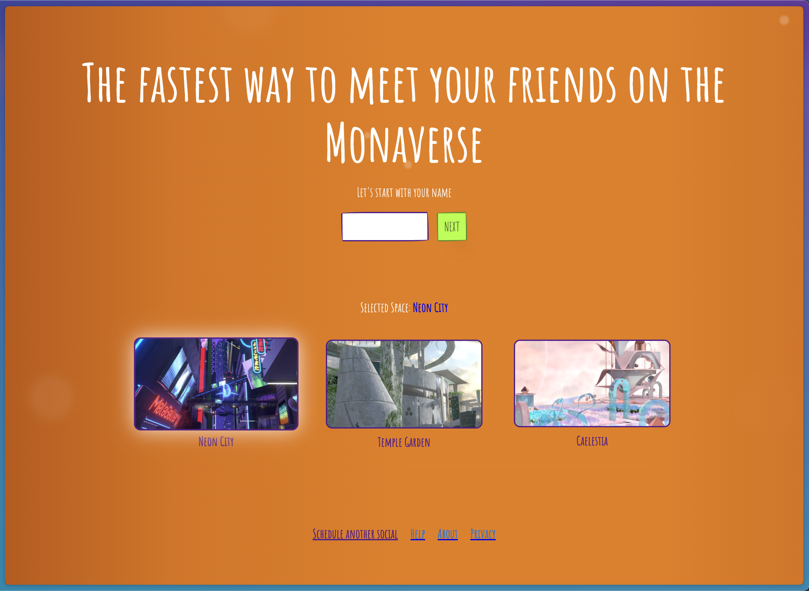

# MetaMeet



Welcome to **MetaMeet** – a fast, efficient, and easy-to-use tool for scheduling virtual meetups in the MONA metaverse, without the hassle of logins or complex setups.

## Overview

MetaMeet is designed to streamline the process of organizing meetups in the MONA metaverse. With a focus on simplicity and speed, our tool allows users to quickly set up a meeting or event in just a few clicks. Whether you're planning a casual social gathering or a formal business meeting, MetaMeet makes it effortless.

## Features

- **No Login Required:** Jump straight into scheduling without any sign-up process.
- **Fast and Lightweight:** Optimized for quick loading and smooth user experience.
- **MONA Metaverse Integration:** Seamlessly schedule events in the immersive MONA spaces.
- **User-Friendly Interface:** Intuitive design makes it easy for anyone to use.

## Getting Started

To get started with MetaMeet, follow these simple steps:

1. **Clone the Repository:**
   ```bash
   git clone https://github.com/saurabhchalke/MetaMeet.git
   ```

2. **Install Dependencies:**
   ```bash
   npm install
   ```

3. **Run the necessary scripts:**
   ```bash
   nvm use # use the version of node specified in .nvmrc
   cp .env.template .env
   npx web-push generate-vapid-keys # copy the output into the values for VAPID_PUBLIC_KEY and VAPID_PRIVATE_KEY in .env
   npm dotenv > .envrc && direnv allow
   npm run db # start fauna db locally on docker
   npm run db:init # Copy the secret from stdout into the value for FAUNADB_INVITEE_SECRET in .env
   ```

4. **Start the development server:**
   ```bash
   npm run dev
   ```

**Note:** Refer to the `faunadb-cloud` branch if you would like to deploy it to FaunaDB Cloud instead of running it locally. The fauna db clients in the `faunadb-cloud` branch are configured to use the FaunaDB Cloud instance.
